# Serverless Application, restaurants orders

# Contents
* [Architecture overview](#Architecture overview)
* [Users module](#users-module)


Continue to:

 - [x] 3 - Add structured logging with Powertools
 - \

# Architecture overview

```text


┌─────────────────┐    ┌──────────────────┐    ┌─────────────────────┐
│   Cognito       │    │   API Gateway    │    │    EventBridge      │
│   User Pool     │◄───┤  (ProfileApi)    │───►│   (AddressBus)      │
│                 │    │                  │    │                     │
└─────────────────┘    └──────────────────┘    └─────────────────────┘
                                │                          │
                                │                          │
                                ▼                          ▼
                       ┌──────────────────┐    ┌─────────────────────┐
                       │      SQS         │    │   Lambda Functions  │
                       │ FavoriteRestaurants│   │                     │
                       │     Queue        │    │ • AddUserAddress    │
                       └──────────────────┘    │ • EditUserAddress   │
                                │              │ • DeleteUserAddress │
                                │              │ • ListUserAddresses │
                                ▼              │ • ProcessFavorites  │
                       ┌──────────────────┐    │ • ListUserFavorites │
                       │   Lambda         │    └─────────────────────┘
                       │ProcessFavorites  │              │
                       │    Queue         │              │
                       └──────────────────┘              ▼
                                │              ┌─────────────────────┐
                                ▼              │     DynamoDB        │
                       ┌──────────────────┐    │                     │
                       │   DynamoDB       │    │ • UserAddressesTable│
                       │ FavoritesTable   │◄───┤ • FavoritesTable    │
                       └──────────────────┘    └─────────────────────┘

```


Mermaid:


# Users Module

## Serverless Users API
Authorization: {{jwt}}

A serverless REST API for user management built with AWS SAM, featuring JWT authentication via Amazon Cognito and DynamoDB storage.

## Architecture

### Users module Infrastructure Diagram

```mermaid
graph TB
    Client["🌐 Client Application"] --> CognitoAuth["🔐 Cognito User Pool<br/>Authentication"]
    CognitoAuth --> Client
    
    Client --> APIGW["🚪 API Gateway<br/>(REST API)"]
    
    APIGW --> Auth["🛡️ Lambda Authorizer<br/>(JWT Validation)"]
    Auth --> Cognito["👥 Cognito User Pool<br/>(User Management)"]
    Auth --> APIGW
    
    APIGW --> UsersLambda["⚡ Users Lambda<br/>(CRUD Operations)"]
    UsersLambda --> DDB["🗄️ DynamoDB<br/>(Users Table)"]
    
    subgraph "AWS Cloud"
        subgraph "Authentication Layer"
            CognitoAuth
            Cognito
            Auth
        end
        
        subgraph "API Layer"
            APIGW
        end
        
        subgraph "Business Logic Layer"
            UsersLambda
        end
        
        subgraph "Data Layer"
            DDB
        end
    end
    
    style Client fill:#e1f5fe
    style CognitoAuth fill:#fff3e0
    style Cognito fill:#fff3e0
    style Auth fill:#f3e5f5
    style APIGW fill:#e8f5e8
    style UsersLambda fill:#fff9c4
    style DDB fill:#fce4ec
```




### Request Flow

```
1. Client authenticates with Cognito User Pool
2. Cognito returns JWT token
3. Client sends API request with JWT token
4. API Gateway triggers Lambda Authorizer
5. Authorizer validates JWT with Cognito
6. Authorizer returns IAM policy
7. API Gateway forwards request to Users Lambda
8. Users Lambda performs CRUD operations on DynamoDB
9. Response flows back to client
```

### AWS Services Used

- **API Gateway** - REST API endpoints with custom authorization
- **Lambda Functions** - Business logic and JWT token validation
- **DynamoDB** - NoSQL database for user data storage
- **Cognito User Pool** - User authentication and JWT token management
- **CloudFormation** - Infrastructure as Code via SAM

### Component Details

| Component | Purpose | Technology |
|-----------|---------|------------|
| **Client** | Web/Mobile application | Any HTTP client |
| **API Gateway** | API endpoint management | AWS API Gateway REST |
| **Lambda Authorizer** | JWT validation & authorization | Python 3.13 |
| **Users Lambda** | Business logic for CRUD operations | Python 3.13 |
| **Cognito User Pool** | User authentication & JWT issuing | AWS Cognito |
| **DynamoDB** | User data persistence | NoSQL database |

## Features

- ✅ CRUD operations for user management
- ✅ JWT-based authentication with Cognito
- ✅ Custom Lambda authorizer with role-based access control
- ✅ Admin group privileges for full user management
- ✅ Individual user access to own resources
- ✅ Serverless architecture with pay-per-use pricing

## Prerequisites

- AWS CLI configured with appropriate permissions
- SAM CLI installed
- Python 3.13
- An AWS account

## Quick Start

### 1. Deploy the Application

```bash
# Build the application
sam build

# Deploy with guided prompts
sam deploy --guided

# Or deploy with parameters
sam deploy --parameter-overrides UserPoolAdminGroupName=myAdmins
```

### 2. Get Deployment Information

After deployment, note the outputs:
- `APIEndpoint` - Your API base URL
- `UserPool` - Cognito User Pool ID
- `UserPoolClient` - Cognito App Client ID
- `CognitoAuthCommand` - CLI command template for authentication

### 3. Create a User

```bash
# Create a user in Cognito
aws cognito-idp admin-create-user \
  --user-pool-id <USER_POOL_ID> \
  --username <EMAIL> \
  --user-attributes Name=email,Value=<EMAIL> Name=name,Value="<FULL_NAME>" \
  --temporary-password <TEMP_PASSWORD> \
  --message-action SUPPRESS
```

### 4. Authenticate and Get Token

```bash
# Get JWT token
aws cognito-idp initiate-auth \
  --auth-flow USER_PASSWORD_AUTH \
  --client-id <CLIENT_ID> \
  --auth-parameters USERNAME=<EMAIL>,PASSWORD=<PASSWORD> \
  --query 'AuthenticationResult.IdToken' \
  --output text
```

### 5. Test the API

```bash
# Set your token and API endpoint
export TOKEN="<YOUR_JWT_TOKEN>"
export API_URL="<YOUR_API_ENDPOINT>"

# Get all users (admin only)
curl -H "Authorization: $TOKEN" "$API_URL/users"

# Get specific user
curl -H "Authorization: $TOKEN" "$API_URL/users/<USER_ID>"

# Create user (admin only)
curl -X POST -H "Authorization: $TOKEN" -H "Content-Type: application/json" \
  -d '{"name":"John Doe","email":"john@example.com"}' \
  "$API_URL/users"

# Update user
curl -X PUT -H "Authorization: $TOKEN" -H "Content-Type: application/json" \
  -d '{"name":"John Smith","email":"john.smith@example.com"}' \
  "$API_URL/users/<USER_ID>"

# Delete user
curl -X DELETE -H "Authorization: $TOKEN" "$API_URL/users/<USER_ID>"
```

## API Endpoints

| Method | Endpoint | Description | Access |
|--------|----------|-------------|---------|
| GET | `/users` | List all users | Admin only |
| POST | `/users` | Create new user | Admin only |
| GET | `/users/{userid}` | Get specific user | Owner or Admin |
| PUT | `/users/{userid}` | Update user | Owner or Admin |
| DELETE | `/users/{userid}` | Delete user | Owner or Admin |

## Authentication & Authorization

### JWT Token Authentication
All API requests require a valid JWT token in the `Authorization` header. Tokens are issued by Amazon Cognito after successful authentication.

### Access Control Rules
- **Regular Users**: Can only access their own user resources (`/users/{their-user-id}`)
- **Admin Users**: Can access all user resources and perform administrative operations
- **Admin Group**: Users in the `apiAdmins` group (configurable) have full access

### Getting Admin Privileges

```bash
# Add user to admin group
aws cognito-idp admin-add-user-to-group \
  --user-pool-id <USER_POOL_ID> \
  --username <EMAIL> \
  --group-name apiAdmins
```

## Configuration

### Parameters

- `UserPoolAdminGroupName` (default: `apiAdmins`) - Name of the Cognito group for API administrators

### Environment Variables

The Lambda functions use these environment variables:
- `USERS_TABLE` - DynamoDB table name
- `USER_POOL_ID` - Cognito User Pool ID
- `APPLICATION_CLIENT_ID` - Cognito App Client ID
- `ADMIN_GROUP_NAME` - Admin group name

## Project Structure

```
users/
├── template.yaml              # SAM template
├── src/
│   └── api/
│       ├── users.py          # Main API handler
│       └── authorizer.py     # Custom Lambda authorizer
└── README.md
```

## Development

### Local Testing

```bash
# Start API locally
sam local start-api

# Test specific function
sam local invoke UsersFunction -e events/test-event.json
```

### Dependencies

The project uses these Python packages:
- `python-jose[cryptography]` - JWT token validation
- `boto3` - AWS SDK

## Troubleshooting

### Common Issues

1. **"Unauthorized" errors**
   - Verify JWT token is valid and not expired
   - Check token is in Authorization header
   - Ensure user exists in Cognito User Pool

2. **"Access Denied" errors**
   - Verify user has appropriate permissions
   - Check if admin privileges are needed
   - Confirm user is in correct Cognito group

3. **Deployment failures**
   - Ensure AWS CLI is configured
   - Check IAM permissions
   - Verify region settings

### Logs

```bash
# View Lambda logs
sam logs -n UsersFunction --stack-name <STACK_NAME> --tail

# View authorizer logs
sam logs -n AuthorizerFunction --stack-name <STACK_NAME> --tail
```

## Cleanup

```bash
# Delete the stack
sam delete --stack-name <STACK_NAME>
```

## Security Considerations

- JWT tokens are validated using Cognito's public keys
- All API endpoints require authentication
- Fine-grained access control based on user identity
- DynamoDB access is scoped to the Lambda execution role
- API Gateway has built-in throttling and monitoring

## License

This project is licensed under the MIT-0 License. See the LICENSE file for details.